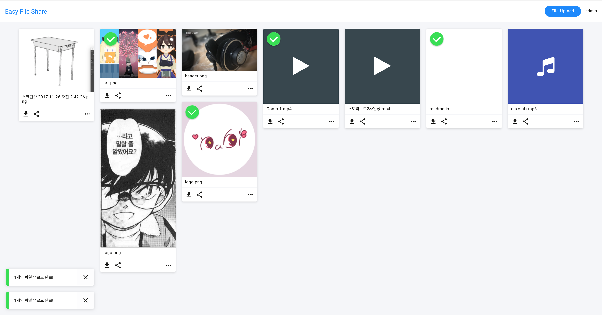

# easy-file-share

Easy File Share React App.  
누구나! 쉽게!(?!) 파일을 공유할 수 있도록 도와주는 서비스? 프로그램? 입니다.  
~~물론..쉽진않지만..db설정이라던가...커맨드라던ㄱ...~~  
여튼... 열심히 개발중 입니다...!  
## Stack
### Client

#### React
>react-dropzone  
react-masonry-component  
react-motion  
react-redux  
react-router-dom  
react-transition-group  
reactstrap  

#### HTTP Request
>axios  

#### Redux
>redux-thunk  
immutable  
redux-devtools-extension  
### Server

#### Koa web framework
>koa-bodyparser  
koa-helmet  
koa-multer  
koa-passport  
koa-redis  
koa-router  
koa-session  
koa-static  
koa-webpack  
koa-webpack-middleware  

#### Image Processing System
>gm - GraphicsMagick  

#### Database connect
>promise-mysql  

#### Session
>redis

#### Authentication
>Passport  
passport-local  

#### uuidgenerator
>uuid  

### Development Environment(?)
#### webpack
>webpack-dev-server  
babel-loader  
node-sass  
sass-loader  
style-loader  
css-loader
autoprefixer  
postcss-loader  

#### babel
>babel-plugin-transform-object-rest-spread  
babel-preset-es2015  
babel-preset-react  
